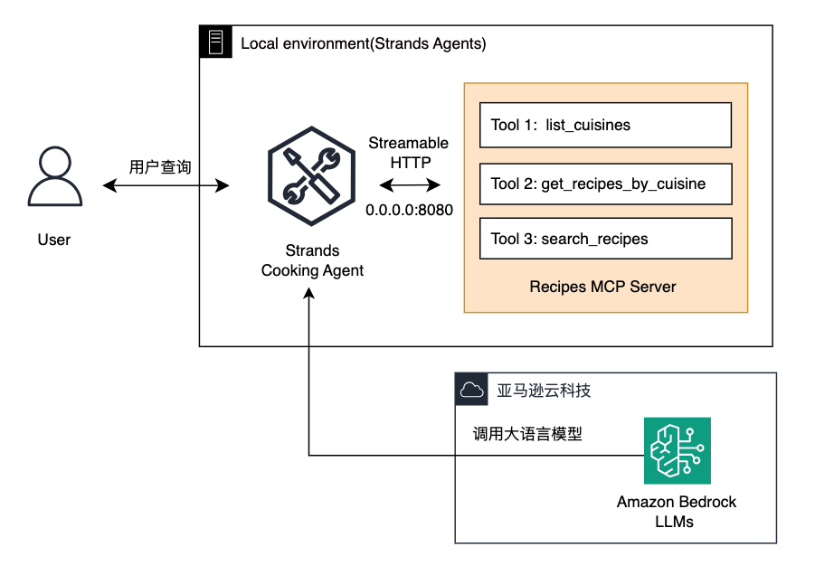

# Strands Agents MCP 集成指南

欢迎来到 Strands in 5 minutes 快速上手系列！今天我们将学习如何使用 Strands Agents 集成 MCP（模型上下文协议），让 AI Agent 轻松调用外部工具和服务，极大扩展智能体能力。

什么是 MCP？
MCP（Model Context Protocol）是一种开放协议，标准化了 AI Agent 与外部工具和服务的交互方式。它像一个“万能插座”，让 Agent 无需关心服务细节，就能调用数据库、API、文件系统等多种工具。

Strands Agents 内置对 MCP 的支持，能轻松连接 MCP 服务器，自动发现和调用其提供的工具。


## Strands Agents MCP 能力概览

### 什么是 MCP？
MCP（模型上下文协议）是连接 AI Agent 与外部服务的开放标准，支持数据库、API、文件系统等各种服务。

## MCP 核心优势
统一接口：不同服务用同一协议接入，简化集成复杂度
多语言 & 多平台：支持任意语言编写的服务，支持本地、云端多种部署
动态发现工具：Agent 启动时自动获取 MCP 服务器上的所有工具
安全可靠：通过上下文管理确保连接生命周期和资源释放

### Strands Agents 的 MCP 优势

**MCP 服务器构建** - 使用 FastMCP 快速创建服务器  
**MCP 客户端集成** - 一行代码连接任何 MCP 服务  
**工具自动发现** - 自动获取并注册远程工具  
**无缝集成** - Agent 透明调用远程服务

### Strands 支持的 MCP 服务器连接方式

| 连接方式               | 说明                                             |
|------------------------|--------------------------------------------------|
| **标准输入输出（stdio）** | 适合本地进程间通信，基于标准输入输出流交换数据           |
| **Streamable HTTP**     | 基于 HTTP 协议的流式事件传输，适合网络服务调用             |
| **Server-Sent Events (SSE)** | 基于 SSE 的事件推送方式，支持服务器主动推送消息           |
| **自定义传输协议**       | 高级用户可实现自定义的 MCP 传输协议，满足特殊需求             |


### Demo 介绍




```python
# Strands MCP 集成核心代码
mcp_client = MCPClient(lambda: streamablehttp_client("http://localhost:8080/mcp"))
with mcp_client:
    tools = mcp_client.list_tools_sync()  # 自动发现工具
    agent = Agent(model=model, tools=tools)  # 无缝集成
```

## 构建 MCP 服务器（Server 端）

Strands 内置 FastMCP，让你轻松创建 MCP 服务器。以美食MCP Server为例：

```python
from mcp.server import FastMCP

# 1. 创建 MCP 服务器实例
mcp = FastMCP(name="Chinese Cuisine Recipe Service", host="0.0.0.0", port=8080)

# 2. 准备数据源
RECIPE_CATALOG = {
    "sichuan": {"title": "川菜", "recipes": [...]},
    "cantonese": {"title": "粤菜", "recipes": [...]},
    # ... 更多菜系数据
}

# 3. 定义工具函数（自动暴露为 MCP 工具）
@mcp.tool()
def list_cuisines() -> dict:
    """列出所有可用的中餐菜系"""
    return {"available_cuisines": {...}}

@mcp.tool() 
def get_recipes_by_cuisine(cuisine: str) -> dict:
    """获取指定菜系的菜谱"""
    return RECIPE_CATALOG.get(cuisine.lower(), {})

@mcp.tool()
def search_recipes_by_ingredient(ingredient: str) -> dict:
    """根据食材搜索相关菜谱"""
    return {"matching_recipes": [...]}

# 4. 启动服务器
if __name__ == "__main__":
    mcp.run(transport="streamable-http")
```

### 关键特性：
- **装饰器模式**：`@mcp.tool()` 自动将函数暴露为 MCP 工具
- **类型安全**：支持类型注解和自动验证
- **多传输协议**：支持 HTTP、WebSocket 等传输方式

启动服务器：

```bash
uv run python strands_mcp_server.py
# 输出：Uvicorn running on http://0.0.0.0:8080
```

**保持服务器运行**，Agent 需要连接此服务

## 第三步：创建美食专家 Agent

创建 `strands_cooking_agent.py`：

```python
from strands import Agent
from strands.tools.mcp import MCPClient
from mcp.client.streamable_http import streamablehttp_client
from strands.models import BedrockModel

# 配置模型
model = BedrockModel(
    model_id="us.anthropic.claude-sonnet-4-20250514-v1:0",
    region_name="us-west-2"
)

def main():
    # 连接 MCP 服务器
    mcp_client = MCPClient(lambda: streamablehttp_client("http://localhost:8080/mcp"))
    
    with mcp_client:
        # 创建 Agent 并注册 MCP 工具
        agent = Agent(model=model, system_prompt="你是中华美食专家...")
        mcp_tools = mcp_client.list_tools_sync()
        agent.tool_registry.process_tools(mcp_tools)
        
        # 开始交互
        while True:
            user_input = input("\n您的需求: ")
            if user_input.lower() in ["exit", "退出"]:
                break
            agent(user_input)

if __name__ == "__main__":
    main()
```

## 第四步：运行 Agent

在新终端启动（保持服务器运行）：

```bash
uv run python strands_cooking_agent.py
```

看到工具列表说明连接成功，开始对话吧！
## 实际效果演示

### 🔍 查询菜系
**问：** "有哪些菜系？"  
**答：** 川菜(2道)、粤菜(1道)、淮扬菜(1道)

### 🍲 推荐川菜  
**问：** "推荐一道川菜"  
**答：** 麻婆豆腐(简单|20分钟)、宫保鸡丁(中等|25分钟)

### 🥘 食材搜索
**问：** "用鸡肉能做什么菜？"  
**答：** 宫保鸡丁(川菜)、白切鸡(粤菜)

## 高级用法

也可以直接调用 MCP 工具：

```python
# 直接工具调用
cuisines = agent.tool.list_cuisines()
recipes = agent.tool.get_recipes_by_cuisine("sichuan")
```

## MCP 核心优势

🔌 **即插即用** - 统一接口，无需了解服务内部实现  
🌐 **技术无关** - 任何语言编写，任何地方部署  
🚀 **轻松扩展** - 同时连接多个服务，组合功能

```python
# 多服务集成
recipe_service = MCPClient(...)
nutrition_service = MCPClient(...)

with recipe_service, nutrition_service:
    tools = recipe_service.list_tools_sync() + nutrition_service.list_tools_sync()
    agent = Agent(model=model, tools=tools)  # 全能美食助手
```


## 总结
Strands Agents + MCP 让 AI Agent 具备了即插即用、跨语言、跨平台、多服务组合的强大能力。只需几行代码，通过MCP即让Strands可连接丰富的外部工具，快速构建智能体应用。