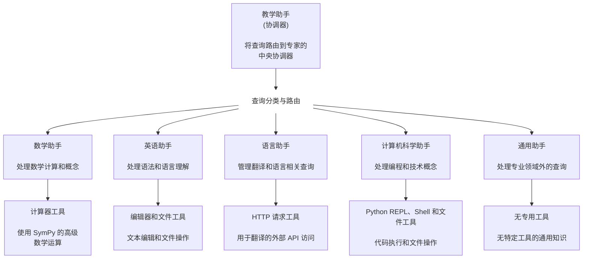

# 教学助手 - Strands Multi-Agent 架构示例

本示例展示了如何使用 Strands Agents 实现 multi-agent 架构，其中专业化的 agents 在中央协调器的协调下共同工作。系统使用自然语言路由，根据主题专业知识将查询定向到最合适的专业化 agent。

## 概述

| 特性              | 描述                                        |
| ----------------- | ------------------------------------------ |
| **使用的工具**     | calculator, python_repl, shell, http_request, editor, file operations |
| **Agent 结构**    | Multi-Agent 架构                           |
| **复杂度**        | 中级                                       |
| **交互方式**      | 命令行界面                                 |
| **关键技术**      | 动态查询路由                               |

## 实现文件

- [teachers_assistant.py](teachers_assistant.py) - 主要的协调 agent，负责将查询路由到专业化 agents
- [math_assistant.py](math_assistant.py) - 处理数学查询的专业化 agent
- [language_assistant.py](language_assistant.py) - 负责语言翻译任务的专业化 agent
- [english_assistant.py](english_assistant.py) - 负责英语语法和理解的专业化 agent
- [computer_science_assistant.py](computer_science_assistant.py) - 负责计算机科学和编程任务的专业化 agent
- [no_expertise.py](no_expertise.py) - 处理特定领域之外查询的通用 assistant

## 工具概述

multi-agent 系统利用多种工具提供专业化功能：

1. `calculator`：由 SymPy 提供支持的高级数学工具，提供全面的计算功能，包括表达式求值、方程求解、微分、积分、极限、级数展开和矩阵运算。

2. `python_repl`：在具有交互式 PTY 支持和状态持久性的 REPL 环境中执行 Python 代码，允许运行代码片段、数据分析和复杂逻辑执行。

3. `shell`：具有 PTY 支持的交互式 shell，用于实时命令执行，支持单个命令、多个顺序命令、并行执行和带有实时输出的错误处理。

4. `http_request`：向外部 API 发出 HTTP 请求，支持全面的身份验证，包括 Bearer tokens、Basic auth、JWT、AWS SigV4 和企业身份验证模式。

5. `editor`：高级文件编辑工具，可创建和修改代码文件，具有语法高亮、精确字符串替换和代码导航功能。

6. `file operations`：用于读取和写入文件的工具，如 `file_read` 和 `file_write`，使 agents 能够根据需要访问和修改文件内容。

## 架构图



## 工作原理和组件实现

这个示例实现了一个 multi-agent 架构，其中专业化的 agents 在中央协调器的协调下共同工作。让我们探讨这个系统的工作原理和每个组件的实现方式。

### 1. 教学助手（协调器）

`teacher_assistant` 作为中央协调器，分析传入的自然语言查询，确定最合适的专业化 agent，并将查询路由到该 agent。所有这些都通过 agent 的 TEACHER_SYSTEM_PROMPT 中概述的指令完成。此外，每个专业化 agent 都是协调器 agent 的工具数组的一部分。

**实现：**

```python
teacher_agent = Agent(
    system_prompt=TEACHER_SYSTEM_PROMPT,
    callback_handler=None,
    tools=[math_assistant, language_assistant, english_assistant, 
           computer_science_assistant, general_assistant],
)
```

- 协调器通过将 `callback_handler` 设置为 `None` 来抑制其中间输出。如果没有这种抑制，默认的 `PrintingStreamHandler` 会将所有输出打印到 stdout，从而创建一个混乱的体验，包含来自每个 agent 思考过程和工具调用的重复信息。

### 2. 专业化 Agents

每个专业化 agent 都使用特定领域功能作为 Strands 工具实现。这种架构允许我们初始化每个 agent，使其专注于特定领域，拥有专业知识，并使用特定工具处理其专业领域内的查询。例如：

**示例：**

数学助手处理数学计算、问题和概念，使用计算器工具。

**实现：**

```python
@tool
def math_assistant(query: str) -> str:
    """
    使用专业数学 agent 处理和响应与数学相关的查询。
    """
    # 为数学 agent 格式化查询，提供明确的指令
    formatted_query = f"请解决以下数学问题，显示所有步骤并清晰解释概念：{query}"
    
    try:
        print("路由到数学助手")
        # 创建具有计算器功能的数学 agent
        math_agent = Agent(
            system_prompt=MATH_ASSISTANT_SYSTEM_PROMPT,
            tools=[calculator],
        )
        response = math_agent(formatted_query)
        
        # 提取并返回响应文本
        # (响应处理代码)
        
    except Exception as e:
        return f"处理您的数学查询时出错：{str(e)}"
```

每个专业化 agent 都有不同的系统提示和工具库，并遵循这种通用模式。

- [语言助手](https://github.com/strands-agents/docs/blob/main/docs/examples/python/multi_agent_example/language_assistant.py) 专门处理与翻译成不同语言相关的查询。
- [计算机科学助手](https://github.com/strands-agents/docs/blob/main/docs/examples/python/multi_agent_example/computer_science_assistant.py) 专门处理与编写、编辑、运行代码和解释计算机科学概念相关的查询。
- [英语助手](https://github.com/strands-agents/docs/blob/main/docs/examples/python/multi_agent_example/english_assistant.py) 专门处理与语法和英语理解相关的查询。
- [通用助手](https://github.com/strands-agents/docs/blob/main/docs/examples/python/multi_agent_example/no_expertise.py) 是一个无专业领域的 agent，旨在回答特定领域之外的查询。

### 3. Tool-Agent 模式

这个示例演示了 "Tool-Agent 模式"，其中 Strands agents 使用 `@tool` 装饰器包装为工具。然后将这些工具提供给另一个 agent（教学助手），创建一个系统，其中 agents 可以使用其他 agents 作为工具。

### 示例交互

**示例 1：数学问题**

```
> 解决二次方程 x^2 + 5x + 6 = 0

路由到数学助手

要解决二次方程 x² + 5x + 6 = 0，我将使用二次公式：

x = (-b ± √(b² - 4ac)) / 2a

其中 a = 1, b = 5, c = 6

步骤 1：计算判别式 b² - 4ac
判别式 = 5² - 4(1)(6)
判别式 = 25 - 24
判别式 = 1

步骤 2：应用二次公式
x = (-5 ± √1) / 2(1)
x = (-5 ± 1) / 2

步骤 3：找出两个解
x₁ = (-5 + 1) / 2 = -4/2 = -2
x₂ = (-5 - 1) / 2 = -6/2 = -3

因此，方程 x² + 5x + 6 = 0 的解是 x = -2 和 x = -3。

您可以通过将这些解代回原始方程来验证：
对于 x = -2：(-2)² + 5(-2) + 6 = 4 - 10 + 6 = 0 ✓
对于 x = -3：(-3)² + 5(-3) + 6 = 9 - 15 + 6 = 0 ✓
```

**示例 2：计算机科学问题**

```
> 编写一个 Python 函数来检查字符串是否为回文

路由到计算机科学助手

这是一个检查字符串是否为回文的 Python 函数：

def is_palindrome(text):
    """
    检查字符串是否为回文。
    
    回文是一个正向和反向读取相同的字符串，
    忽略大小写、标点符号和空格。
    
    Args:
        text (str): 要检查的字符串
        
    Returns:
        bool: 如果字符串是回文则为 True，否则为 False
    """
    # 转换为小写并删除非字母数字字符
    cleaned_text = ''.join(char.lower() for char in text if char.isalnum())
    
    # 检查清理后的字符串是否等于其反转
    return cleaned_text == cleaned_text[::-1]

# 使用示例
test_strings = [
    "racecar",
    "A man, a plan, a canal: Panama",
    "hello world",
    "Madam, I'm Adam"
]

for string in test_strings:
    result = is_palindrome(string)
    print(f"'{string}' 是回文：{result}")
```

**示例 3：语言翻译请求**

```
> 将 "Hello, how are you?" 翻译成西班牙语

路由到语言助手

"Hello, how are you?" 的西班牙语翻译是：

"Hola, ¿cómo estás?"

关于这个翻译的一些注意事项：

1. "Hola" 是 "Hello" 的西班牙语等价词
2. "¿cómo estás?" 表示 "how are you?"。请注意，西班牙语在问题开头使用倒置问号 (¿)
3. 这个翻译使用了非正式的 "tú" 形式 (estás)。如果您需要正式一些或与不太熟悉的人交谈，您应该说 "¿cómo está usted?"

如果您与多人交谈，您应该说 "¿cómo están ustedes?"（或在西班牙说 "¿cómo estáis?"）。
```

## 扩展示例

以下是您可以扩展这个 multi-agent 示例的一些方法：

1. **添加记忆**：实现会话记忆，使系统记住之前的交互
2. **添加更多专家**：为其他领域创建额外的专业化 agents
3. **实现 Agent 协作**：使多个 agents 能够在复杂查询上协作
4. **创建 Web 界面**：为教学助手构建简单的 Web UI
5. **添加评估**：实现一个系统来评估和提高路由准确性