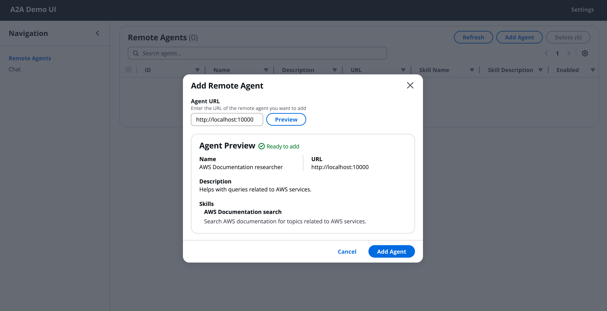
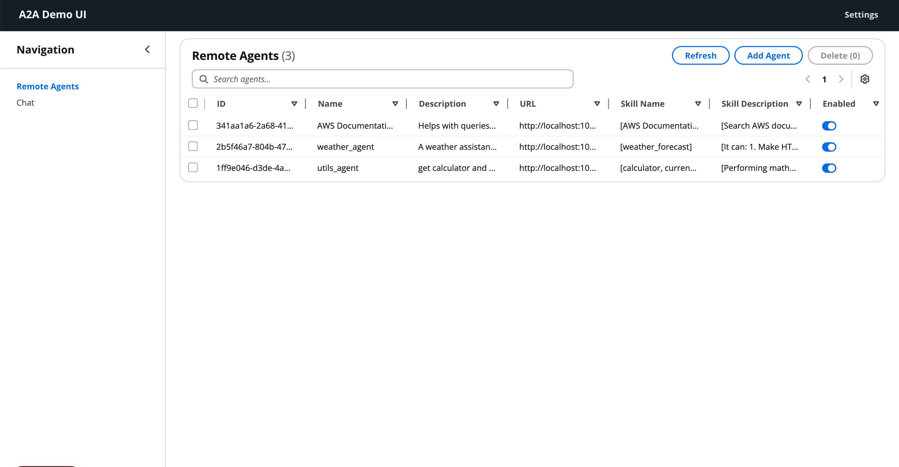
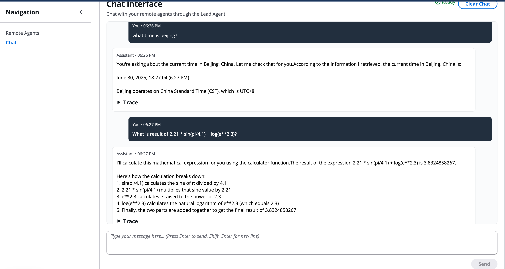

# Agent to Agent (A2A) protocol using Strands Agent SDK

## 1.Getting started

1. Install [uv](https://docs.astral.sh/uv/getting-started/installation/).
2. Configure AWS credentials, follow instructions [here](https://cuddly-sniffle-lrmk2y7.pages.github.io/0.1.x-strands/user-guide/quickstart/#configuring-credentials).

## 2.Start remote agents

### Run `./start_all.sh` to start below 3 agents
1. An example Strands agent that helps with searching AWS documentation.
2. An example Strands agent that provides weather forcast in US
3. An example Strands agent that work as calculator and current time

## 3.Run a multi agents test applications developed with Strands SDK work with above 3 agents via A2A protocal
1.  Start the client using `uv run a2a_client_agent.py`.

## 4.Start a react UI website and add register remote agents
1. go to folder `a2a-agent-ui`
2. run `npm install`
3. run `./start.sh` 
4. visit `http://localhost:3000`
5. add remote agents with urls `http://localhost:10000`,`http://localhost:10001`,`http://localhost:10002`
 
6. After added all agents

6. swith to Chat, try below tasks:
  - "What is current time of beijing"
  - "What is result of 2.21 * sin(pi/4.1) + log(e**2.3)?"
  - "what it the weather forecast in new york?"
