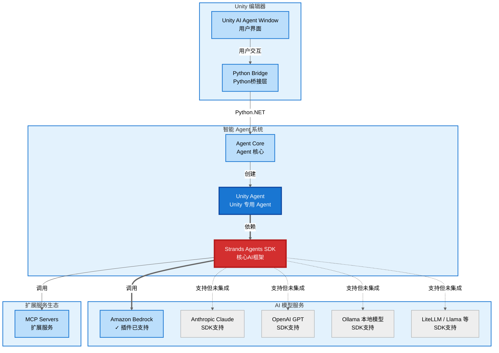
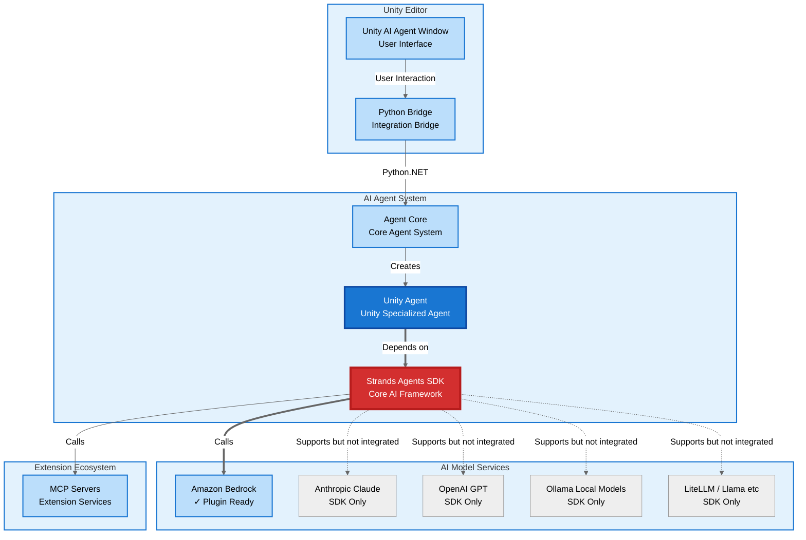

# Unity Strands Agent

基于 AWS [Strands Agents SDK](https://strandsagents.com/latest/) 的 Unity 编辑器 AI 插件，在 Unity 编辑器中直接与 AI 对话，获得问题解答、学习指导和开发建议。

**Language / 语言**：[中文](#中文版本) | [English](#english-version)

---

## 中文版本

Unity Strands Agent 是一个友好易用的 AI 助手，将 AWS 开源的 [Strands Agents SDK](https://strandsagents.com/latest/) 无缝集成到 Unity 编辑器中。该插件内置了对 Unity 项目的深度理解，能够通过自然语言对话帮助您学习 Unity、解决问题、理解项目结构。**通过支持 Model Context Protocol (MCP)，本插件可以与 [mcp-unity](https://github.com/CoderGamester/mcp-unity) 或其他 Unity MCP 插件灵活搭配**，让您轻松上手 Unity 开发，大幅降低学习门槛。

## 核心实现

基于 [Strands Agents SDK](https://strandsagents.com/latest/) 开发智能助手极其简单，核心代码展示了其优雅的设计：

```python
from strands import Agent
from unity_tools import get_unity_tools

class UnityAgent:
    def __init__(self):
        # 初始化 MCP 管理器
        from mcp_manager import MCPManager
        self.mcp_manager = MCPManager()
        
        # 从配置文件加载 MCP 服务器并建立连接
        # 配置示例 (Assets/UnityAIAgent/mcp_config.json):
        # {
        #   "mcpServers": {
        #     "mcp-unity": {
        #       "command": "/usr/local/bin/node",
        #       "args": ["path/to/mcp-unity/Server/build/index.js"],
        #       "env": {"UNITY_PORT": "8090"}
        #     }
        #   }
        # }
        mcp_tools = self.mcp_manager.load_mcp_tools()
        
        # 获取 Unity 开发工具集（包含内置工具和 MCP 工具）
        unity_tools = get_unity_tools(include_mcp=True, agent_instance=self)
        
        # 创建强大的 AI Agent，配备完整工具集
        self.agent = Agent(
            system_prompt=UNITY_SYSTEM_PROMPT, 
            tools=unity_tools  # 21+内置工具 + 动态加载的 MCP 工具
        )
    
    def _load_mcp_tools(self):
        # 由 get_unity_tools 调用，返回已加载的 MCP 工具
        return self.mcp_manager._mcp_tools
    
    def process_message(self, message: str):
        # 处理用户消息，支持 Unity 原生操作
        return self.agent(message)
    
    def cleanup(self):
        # 清理 MCP 连接和资源
        self.mcp_manager.cleanup()
```

通过以上代码可以看到：
- **MCP 配置加载**：从 JSON 配置文件读取 MCP 服务器设置
- **动态工具发现**：MCP 服务器启动后自动发现并加载可用工具
- **工具集整合**：将内置工具与 MCP 工具无缝整合
- **资源管理**：提供清理机制确保连接正确关闭

该插件基于模块化架构设计，通过 MCP 协议轻松扩展工具集，让 AI Agent 能够直接操作 Unity 编辑器。

## 主要特性

### Unity 专业化
- **项目结构理解**：智能识别 Unity 项目结构，提供清晰易懂的解释和指导
- **学习助手**：耐心解答 Unity 概念、工作流程和最佳实践，适合各种经验水平
- **问题解决**：快速诊断常见问题，提供详细的解决步骤和方案
- **编辑器操作**：通过 MCP 协议与 Unity MCP 插件（如 mcp-unity）搭配，实现场景操作、资源管理等直观交互

### 简单易用
- **自然语言交互**：用日常语言描述您的需求，无需学习复杂的技术术语
- **一键安装配置**：自动检测环境、安装依赖，几分钟即可开始使用
- **智能引导**：根据您的问题提供循序渐进的学习建议和操作指导
- **MCP 协议支持**：通过 Model Context Protocol 灵活扩展能力，可与 [mcp-unity](https://github.com/CoderGamester/mcp-unity/blob/main/README_zh-CN.md) 或其他 Unity MCP 插件无缝集成

### 智能助手
- **24/7 在线支持**：随时为您解答 Unity 相关问题，从基础概念到高级技巧
- **个性化学习**：根据您的项目和需求，提供定制化的学习路径和建议
- **持续改进**：通过与您的对话不断学习，提供越来越精准的帮助

### AI 模型支持
- **多模型兼容**：[Strands Agents SDK](https://strandsagents.com/latest/) 支持 Claude、GPT、Llama 等主流 AI 模型
- **当前支持**：本插件当前版本仅支持 Bedrock US Oregon (us-west-2) 区域的 Claude 3.7 Sonnet
- **智能记忆**：记住您的学习进度和项目偏好，提供个性化学习建议

## 系统架构



## 快速开始

### 3分钟快速上手

1. **安装插件**
   ```
   Unity Package Manager → Add package from git URL
   输入：https://github.com/aws-samples/sample-strands-in-5-minutes.git?path=07_unity_strands_agent
   ```

2. **自动配置**
   ```
   Window → Unity Strands Agent → Settings → Environment Setup → Start Setup
   等待自动安装完成（无需任何手动配置）
   ```

3. **开始聊天**
   ```
   点击 `Open AI Assistant`，像聊天一样问问题即可
   例如："Unity中的GameObject是什么？"
   ```

**系统要求**：Unity 2022.3+ | Python 3.11 | macOS | AWS credentials

**视频教程**：[Unity Strands Agent 功能演示](https://www.bilibili.com/video/BV1jgGJzhEZs/)


## 详细配置

### 系统要求

- Unity 2022.3 LTS 或更高版本
- Python 3.11（插件会自动检测和配置）
- AWS credentials 配置（默认使用 Amazon Bedrock 服务，默认模型为 US Oregon (us-west-2) 区域的 Claude 3.7 Sonnet）
- **仅支持 macOS 系统**

**重要**：
- 本插件目前仅适配 Python 3.11，暂不支持其他 Python 版本。在 macOS 上可通过 `brew install python@3.11` 安装。
- 环境初始化将在点击 `Environment Setup` 的 `Start Setup` 按钮时进行，请耐心等待安装过程完成。

### 安装步骤

通过 Unity Package Manager 安装：

1. 在 Unity 中打开 Package Manager
2. 点击 "+" 按钮
3. 选择 "Add package from git URL"
4. 输入：`https://github.com/aws-samples/sample-strands-in-5-minutes.git?path=07_unity_strands_agent`
5. 点击 "Add" 并等待 Unity 自动下载和导入

### 配置步骤

1. 在 Unity 中选择菜单：`Window → Unity Strands Agent`
2. 点击 `Settings` 标签页，然后点击 `Environment Setup`
3. 点击 `Start Setup` 按钮开始自动安装
4. 系统将自动完成环境检测、虚拟环境创建、依赖安装等步骤
5. 配置完成后，点击 `Open AI Assistant` 开始使用

### 环境配置

插件会自动设置以下环境变量：

- `PROJECT_ROOT_PATH`：项目根目录路径
- `STRANDS_TOOLS_PATH`：Strands工具路径

配置文件保存在 `Assets/UnityAIAgent/PathConfiguration.asset` 中，会自动加载。插件使用 AWS credentials 配置文件访问 Bedrock 服务。

**MCP 服务器配置**：本插件支持通过 MCP 协议与各种 Unity MCP 插件搭配使用。在 Unity 编辑器界面的 Settings → MCP Configuration 中以 JSON 格式添加服务器配置。建议使用绝对路径配置 `command` 字段，例如配置 mcp-unity 插件：
```json
{
  "mcpServers": {
    "mcp-unity": {
      "command": "/usr/local/bin/node",
      "env": {
        "UNITY_PORT": "8090"
      },
      "args": [
        "/path/to/your/unity-project/Library/PackageCache/com.gamelovers.mcp-unity@latest/Server/build/index.js"
      ]
    }
  }
}
```

您可以根据需求选择和配置不同的 Unity MCP 插件。关于 mcp-unity 插件的详细安装和使用说明，请参考：[mcp-unity 插件文档](https://github.com/CoderGamester/mcp-unity/blob/main/README_zh-CN.md)

### 故障排除

**菜单项不显示**
- 检查Unity控制台是否有编译错误
- 确认包已正确下载到Library/PackageCache目录
- 重启Unity编辑器

**Python 3.11 环境问题**
- 确认系统已安装 Python 3.11：`python3.11 --version`
- 在 macOS 上安装：`brew install python@3.11`
- 重新运行 `Environment Setup` 进行自动配置

**找不到agent_core模块**
- 运行 `Environment Setup` 重新安装Python依赖
- 检查Library/PackageCache中是否有com.aws-samples.unity-strands-agent包
- 确认虚拟环境在项目Python目录中正确创建

如有问题，请检查Unity控制台的错误日志，并在设置页面点击 `验证配置` 查看当前配置状态。

### 支持和反馈

- **文档**：[Strands Agents SDK 官方文档](https://strandsagents.com/latest/)
- **问题反馈**：[GitHub Issues](https://github.com/aws-samples/sample-strands-in-5-minutes/issues)

### 参考资料

#### Strands Agents SDK
- **官方文档**：https://strandsagents.com/latest/
- **Python SDK**：https://github.com/strands-agents/sdk-python
- **示例代码**：https://github.com/strands-agents/samples
- **工具包**：https://github.com/strands-agents/tools
- **Agent Builder**：https://github.com/strands-agents/agent-builder

#### 技术实现
- **Python.NET**：https://github.com/pythonnet/pythonnet
- **Model Context Protocol (MCP)**：https://modelcontextprotocol.io/
- **Unity Editor 扩展**：https://docs.unity3d.com/Manual/ExtendingTheEditor.html

#### 相关项目
- **mcp-unity 插件**：https://github.com/CoderGamester/mcp-unity
- **PythonForUnity**：https://github.com/Maesla/PythonForUnity

---

## English Version

Unity Strands Agent is a friendly and accessible AI assistant that seamlessly integrates AWS's open-source [Strands Agents SDK](https://strandsagents.com/latest/) into the Unity Editor. Built with deep understanding of Unity project structures and workflows, this plugin helps you learn Unity, solve problems, and understand project organization through natural language conversations. **Through support for the Model Context Protocol (MCP), it can be flexibly paired with [mcp-unity](https://github.com/CoderGamester/mcp-unity) or other Unity MCP plugins** to make Unity development approachable and significantly lower the learning curve.

## Core Implementation

Building intelligent assistants with the [Strands Agents SDK](https://strandsagents.com/latest/) is remarkably simple. The core implementation showcases its elegant design:

```python
from strands import Agent
from unity_tools import get_unity_tools

class UnityAgent:
    def __init__(self):
        # Initialize MCP manager
        from mcp_manager import MCPManager
        self.mcp_manager = MCPManager()
        
        # Load MCP servers from config and establish connections
        # Config example (Assets/UnityAIAgent/mcp_config.json):
        # {
        #   "mcpServers": {
        #     "mcp-unity": {
        #       "command": "/usr/local/bin/node",
        #       "args": ["path/to/mcp-unity/Server/build/index.js"],
        #       "env": {"UNITY_PORT": "8090"}
        #     }
        #   }
        # }
        mcp_tools = self.mcp_manager.load_mcp_tools()
        
        # Load Unity development toolset (includes built-in and MCP tools)
        unity_tools = get_unity_tools(include_mcp=True, agent_instance=self)
        
        # Create a powerful AI Agent with complete toolset
        self.agent = Agent(
            system_prompt=UNITY_SYSTEM_PROMPT, 
            tools=unity_tools  # 21+ built-in tools + dynamically loaded MCP tools
        )
    
    def _load_mcp_tools(self):
        # Called by get_unity_tools to retrieve loaded MCP tools
        return self.mcp_manager._mcp_tools
    
    def process_message(self, message: str):
        # Process user messages with Unity native operations support
        return self.agent(message)
    
    def cleanup(self):
        # Cleanup MCP connections and resources
        self.mcp_manager.cleanup()
```

The code above demonstrates:
- **MCP Configuration Loading**: Reads MCP server settings from JSON configuration files
- **Dynamic Tool Discovery**: Automatically discovers and loads available tools after MCP server startup
- **Tool Integration**: Seamlessly combines built-in tools with MCP tools
- **Resource Management**: Provides cleanup mechanisms to ensure connections are properly closed

Built on a modular architecture, this plugin leverages the MCP protocol to extend the toolset, enabling the AI Agent to directly operate the Unity Editor.

## Key Features

### Unity Specialization
- **Project Understanding**: Intelligently analyzes your Unity project structure and provides clear, easy-to-understand explanations
- **Learning Companion**: Patiently explains Unity concepts, workflows, and best practices suitable for all experience levels
- **Problem Solver**: Quickly diagnoses common issues and provides detailed step-by-step solutions
- **Editor Operations**: Through MCP protocol integration with Unity MCP plugins (such as mcp-unity), enables intuitive scene operations, asset management, and more

### Simple and Accessible
- **Natural Language Interaction**: Describe your needs in everyday language without learning complex technical terminology
- **One-Click Setup**: Automatically detects environment, installs dependencies, ready to use in minutes
- **Intelligent Guidance**: Provides step-by-step learning suggestions and operation guidance based on your questions
- **MCP Protocol Support**: Flexibly extend capabilities through the Model Context Protocol, seamlessly integrating with [mcp-unity](https://github.com/CoderGamester/mcp-unity/blob/main/README.md) or other Unity MCP plugins

### Intelligent Assistant
- **24/7 Support**: Always available to answer your Unity questions, from basic concepts to advanced techniques
- **Personalized Learning**: Provides customized learning paths and suggestions based on your projects and needs
- **Continuous Improvement**: Learns from your conversations to provide increasingly accurate and helpful assistance

### AI Model Support
- **Multi-Model Compatibility**: The [Strands Agents SDK](https://strandsagents.com/latest/) supports Claude, GPT, Llama, and other leading AI models
- **Current Support**: This plugin currently only supports Claude 3.7 Sonnet in Bedrock US Oregon (us-west-2) region
- **Intelligent Memory**: Automatically remembers your project patterns, coding style, and preferences across sessions

## System Architecture



## Quick Start

### 3-Minute Quick Start

1. **Install Plugin**
   ```
   Unity Package Manager → Add package from git URL
   Enter: https://github.com/aws-samples/sample-strands-in-5-minutes.git?path=07_unity_strands_agent
   ```

2. **Auto Setup**
   ```
   Window → Unity Strands Agent → Settings → Environment Setup → Start Setup
   Wait for automatic installation (no manual configuration needed)
   ```

3. **Start Chatting**
   ```
   Click `Open AI Assistant` and ask questions like chatting
   Example: "What is a GameObject in Unity?"
   ```

**Requirements**: Unity 2022.3+ | Python 3.11 | macOS | AWS credentials

**Video Demo**: [Unity Strands Agent Demo](https://www.bilibili.com/video/BV1jgGJzhEZs/)


## Detailed Configuration

### System Requirements

- Unity 2022.3 LTS or higher
- Python 3.11 (plugin automatically detects and configures)
- AWS credentials configuration (default model provider is Amazon Bedrock with Claude 3.7 Sonnet in the US Oregon (us-west-2) region)
- **macOS only**

**Important**:
- This plugin currently only supports Python 3.11 and does not support other Python versions. On macOS, install with `brew install python@3.11`.
- Environment initialization will occur when you click the `Start Setup` button in `Environment Setup`, please wait for the installation process to complete.

### Installation Steps

Through Unity Package Manager:

1. Open Package Manager in Unity
2. Click "+" button
3. Select "Add package from git URL"
4. Enter: `https://github.com/aws-samples/sample-strands-in-5-minutes.git?path=07_unity_strands_agent`
5. Click "Add" and wait for Unity to automatically download and import

### Configuration Steps

1. In Unity, select menu: `Window → Unity Strands Agent`
2. Click `Settings` tab, then click `Environment Setup`
3. Click `Start Setup` button to begin automatic installation
4. The system will automatically complete environment detection, virtual environment creation, dependency installation
5. After configuration completes, click `Open AI Assistant` to start using

Main capabilities include:
- Clear explanations of Unity concepts and project structure
- Step-by-step guidance for common Unity tasks and workflows
- Helpful suggestions for learning Unity development
- Friendly assistance with Unity-specific questions and challenges

### Environment Configuration

The plugin automatically sets the following environment variables:

- `PROJECT_ROOT_PATH`: Project root directory path
- `STRANDS_TOOLS_PATH`: Strands tools path

Configuration is saved in `Assets/UnityAIAgent/PathConfiguration.asset` and will be automatically loaded. The plugin uses AWS credentials configuration files to access Bedrock services.

**MCP Server Configuration**: This plugin supports pairing with various Unity MCP plugins through the MCP protocol. Configure MCP servers through the Unity editor interface at Settings → MCP Configuration in JSON format. It's recommended to use absolute paths for the `command` field, for example configuring the mcp-unity plugin:
```json
{
  "mcpServers": {
    "mcp-unity": {
      "command": "/usr/local/bin/node",
      "env": {
        "UNITY_PORT": "8090"
      },
      "args": [
        "/path/to/your/unity-project/Library/PackageCache/com.gamelovers.mcp-unity@latest/Server/build/index.js"
      ]
    }
  }
}
```

You can choose and configure different Unity MCP plugins based on your needs. For detailed installation and usage instructions for the mcp-unity plugin, please refer to: [mcp-unity Plugin Documentation](https://github.com/CoderGamester/mcp-unity/blob/main/README.md)

### Troubleshooting

**Menu Item Not Showing**
- Check Unity console for compilation errors
- Confirm package has been properly downloaded to Library/PackageCache directory
- Restart Unity Editor

**Python 3.11 Environment Issues**
- Confirm Python 3.11 is installed on system: `python3.11 --version`
- Install on macOS: `brew install python@3.11`
- Re-run `Environment Setup` for automatic configuration

**Cannot Find agent_core Module**
- Run `Environment Setup` to reinstall Python dependencies
- Check if com.aws-samples.unity-strands-agent package exists in Library/PackageCache
- Confirm virtual environment is correctly created in project Python directory

If you encounter issues, check Unity console for error logs and click `Validate Configuration` in settings page to view current configuration status.

### Support and Feedback

- **Documentation**: [Strands Agents SDK Official Documentation](https://strandsagents.com/latest/)
- **Issue Reporting**: [GitHub Issues](https://github.com/aws-samples/sample-strands-in-5-minutes/issues)

### References

#### Strands Agents SDK
- **Official Documentation**: https://strandsagents.com/latest/
- **Python SDK**: https://github.com/strands-agents/sdk-python
- **Sample Code**: https://github.com/strands-agents/samples
- **Tools Package**: https://github.com/strands-agents/tools
- **Agent Builder**: https://github.com/strands-agents/agent-builder

#### Technical Implementation
- **Python.NET**: https://github.com/pythonnet/pythonnet
- **Model Context Protocol (MCP)**: https://modelcontextprotocol.io/
- **Unity Editor Extensions**: https://docs.unity3d.com/Manual/ExtendingTheEditor.html

#### Related Projects
- **mcp-unity Plugin**: https://github.com/CoderGamester/mcp-unity
- **PythonForUnity**: https://github.com/Maesla/PythonForUnity
